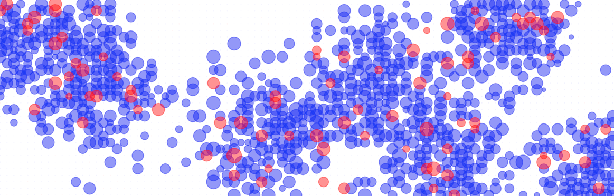
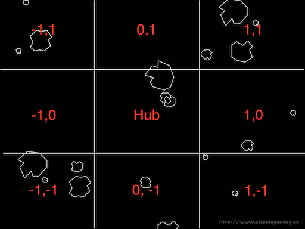

>Mar 2025 Preamble: 
>I wrote this years ago for the 2018 CEC hosted by the Toronto Metropolitan University (formerly Ryerson University).  This app **doesn't work in its current state**. It was deployed to [pythonanywhere](https://www.pythonanywhere.com) for the competition, but I'm working on getting it running on a local Django. 
>
>Two things are missing (AFAIK) are:
>1. the _live status_ page which displayed where all the teams's hubs in the asteroid belt and their current income during the competition.
>2. the deployment instructions I wrote in great detail.
>
>The name Sid Meier shows up here and there in code because it was in the original name, but, due to licensing, we had to rename it.  Ryerson engineering students will recognize Ol' Musky.

# Canadian Engineering Competition 2018

**Programming Challenge**

## Mining Asteroids for Ol' Musky

### Competition

Your mandate is to develop an autonomous asteroid mining system (AI) that makes the most money with the fewest resources for the Ol' Musky Mining Company.  

Starting with $250,000,000 of capital, your AI will interface with Ol' Musky's **Master Control Program (MCP)** which will carry out your instructions and queries for **all** phases of your mining operation. Your AI will be responsible for building and deploying robotic mining hubs in the asteroid belt between Mars and Jupiter and shipping the ore back to Earth. Your task is basically engineering a Supply Chain Management AI. Easy, eh?


 **Fig 1. Sample distribution of ore deposits**

### Operations (What your AI will do)

**Your AI will be completely autonomous**; i.e. once initiated, it will run entirely on its own without input or intervention until the time limit has been reached. Time is measured by the MCP in weeks where 1 MCP week = {{ms_per_week}}ms of real time. Each run is 5 MCP years which is about 1 minute of real time. During development, you may run your AI as often as you require.

Think about what an "autonomous" architecture means: input -> decision -> action.

_NOTE: During your presentation, your AI will run only once with entirely different parameters._

### Interfacing with the MCP (How your AI will work)

All communication with the MCP is done through its RESTful API. Your code can be written in any compiled or interpreted language or script. There are some language docs for HTTP requests in the [Language reference](#language_refs).

- All responses from the MCP are in JSON format (structures in API Specification)
- All MCP instructions cost time and money (see Costs) but the reports are free

### MCP API Overview (The tools your AI will use)

- **Startup (Initialization)**
  - The /mcp/startup API call bootstraps your AI's profile on the MCP and cleans out all historical data and starts the clock.
  - This must be the first call your AI makes for each run.
  - The MCP's response from /mcp/startup is a status report (see /mcp/status_report)

- **Parameters (MCP Constants)**
  - The /mcp/parameters API simply dumps all the constants used by the MCP. These parameters may change slightly during development so your AI should not treat them as hard-coded. You will be clearly notified of any changes. However, for your presentation, the parameters will be significantly different.
    - Competition lifetime (in weeks)
    - Asteroid belt segment size in rows and columns
    - Hub capacity in tonnes
    - Rate of mining in tonnes/per bot/per week
    - Real time vs MCP time factor in ms/week
    - Costs of all actions in dollars and time (see Costs)

- **Prospecting Report (Exploration)**
  - Using the /mcp/prospect_report API function, your AI will get data from on-going geological surveys and test bore-holes in the asteroid belt. The report is a list of sectors, the ore type found and an estimate of size of ore deposit in each sector. However, each report contains only a subset of the total sectors
  - A new report is available every {{preport_freq}} MCP weeks progressively covering more of the belt.
  
  **Fig 2. Example of one prospect report - a diagonal exploratory "pass"**
  
  **Fig 3. Each colour represents a separate prospecting report pass (7 in all)**

- **Build Hubs, Deploy Hubs and Move Hubs (Development)**
  - Construct hubs using the /mcp/build_hubs and deploy them to the asteroid belt using /mcp/deploy_hubs APIs.
  - Note: hubs automatically distribute their mining bots and initiate the ore accumulation
  - If a hub runs out of ore to mine, your AI can move the hub using the /mcp/move_hubs API function.
  - Important: Each of these actions is scheduled by the MCP in a work order that takes time to complete. See Costs.
  - A list of all of pending work orders is included in the /mcp/status_report

- **Status Report (Active mining/ore extraction)**
  - The /mcp/status_report provides a snapshot of your operation including your bank balance at the time of the report.
    - Team attributes
    - Financial (see below)
    - List of hubs, their sector IDs, the space remaining in the hub and amount of accumulated ore
    - List of outstanding work-orders

- **Get Ledger (Financials)**
  - The /mcp/get_ledger is exaclty that - your accounting ledger. It's not something your AI should be checking frequently because it can get rather large as time goes on.
  
      |week|item|debit|credit|balance|
      |:---:|:---:|:---:|:---:|:---:|
      |0|startup|0|150|150|
      |1|build|hubs|45|0|105|
      |20|deploy|hubs|66|0|39|

- **Ship Ore (Production)**
  - Ship ore from the hubs back to Earth as hubs fill up
  - The /mcp/market_report has the current ore prices
  - Note: The MCP schedules rocket trips between Earth and the belt as part of the work order

- **Costs**
    |Action|Cost (x millions)|Time (weeks)|
    |:---:|:---|:---:|
    |Build a Hub|${{build_rate}} per hub|{{build_weeks}}|
    |Deploy a Hub|${{deploy_rate}} per hub|{{deploy_weeks}}|
    |Move a Hub|${{move_rate}} per hub|{{move_weeks}}|
    |Ship Ore|${{ship_rate}} per 1000 tonnes|{{ship_weeks}}|

- **Revenue**
  - On Earth, the minerals are automatically extracted from the ore and sold (revenue) at the market value upon arrival.
  - The revenue from ore sales is deposited directly into your account and is reflected in the ledger

### Constraints

- each hub has 8 robotic miners (bots)
- bots may only mine the 8 sectors adjacent to their parent hub (see Example Hub Placement)
- bots may not mine the sector on which the hub is deployed
- bots cannot simultaneously mine the same sectors
- mining stops when a hub is full, the ore is depleted or when a hub is being deployed or moved

## Tips:

- To avoid disqualification through inadvertently DDoSing the server, we recommend your AI checks the status of your orders (in the /mcp/status_report) with a reasonable frequency since the report is updated only once per MCP week ({{ms_per_week}}ms).
- Related to DDoS, also keep an eye on how much data you transmit to the MPC - it doesn't have unlimited bandwidth
- Keep in mind your goal is to earn the most money, so partition your development tasks wisely.
- Be aware that timing won't be exact. Code takes time to execute, data takes time to transmit and networks have contention.
- Before you ask for help with the MCP, check for "garbage in; garbage out" first.
- This is a complex problem so to save valuable presentation time we recommend omitting the problem description from your presentation

## Rules

**As always, violating any rules will result in immediate disqualification**

- Your security api token may be transmitted ONLY to the MCP host URL and must originate from the hotel WiFi.
- NO HACKING the MCP server.
- NO DDoS attacks on the MCP server or other competitors.

### Submission

- The required output from your AI is a time-stamped log of the HTTP requests transmitted in the format: YYYY-MM-DD HH:MM:SS URI
- e.g.
2018-02-09 21:34:13 https://www.cec-2017.ca/mcp/startup?token=71a653928dc1152537d002cd1349f0d4
- All teams must submit their final log file and code in a zip file emailed to dmarchese@ryerson.ca no later than 6:01pm EST on March 9, 2018. Late submissions will not be accepted.

#### Getting Started

1. Obtain a security API access token from the competition coordinator
2. Start coding - the very first API request your code should make is "/mcp/startup" so that each time your code runs, your team's profile and historical data are bootstrapped (reset).

#### Scoring

Objective scoring is based solely on profit (Revenues - Expenses)

**Judging Criteria**

>omitted

---

## Appendix

### API Specification

All RESTful calls to the MCP must be HTTP GET and use this format:

`https://7066414.pythonanywhere.com/mcp/[api]?token=[security api token]`

All responses from the MCP will be in standard JSON format.

- **Startup**
  `GET /mcp/startup?token=[api_token]`
  Example response:
  
   ```json
   startup
   {
      "status_report": {
          "team": {
              "token": "28758463883",
              "name": "eastbank",
              "week": 0,
              "start_time": "2018-02-04 00:42:55.426631+00:00",
              "balance": 250
          },
          "ledger": [
              {
                  "week": 0,
                  "item": "startup",
                   "credit": 250.0,
                   "debit": 0.0
              }
          ],
          "hubs": {}
      },
      "status": 0,
      "description": ""
   }
   ```json

- **Status Report**

  `GET /mcp/status_report?token=[api_token]`

  The most important of all requests, it includes your team's:

  - Attributes including the all important balance
  - List of built/deployed hubs.
  - List of pending MCP orders.
  - Key info about each hub:
    - sector_id: when -1, it means hub has not been deployed
    - amt: the amount of accumulated ore for each ore type collected
    - space_remaining: easy way to determine how "full" the hub is (%)
    - active: when True, hub is actively mining - False only while deploying and moving the hub

  Example Response:

  ```json
  {"status_report": {
      "team": {
          "token": "71a653928dc1152537d002cd1349f0d4",
          "name": "testgremlins",
          "week": 20,
          "start_time": "2018-02-10 07:53:16.279185+00:00",
          "balance": 100
      },
      "hubs": {
          "A": {
              "hub_id": "A",
              "start_time": "2018-02-10 07:53:19.469587+00:00",
              "sector_id": -1,
              "amt": { "X": 12726, "Y": 324 },
              "space_remaining": 100,
              "active": false
          }
      },
      "orders": [
          {
              "week": 12,
              "action": "deliver_hubs",
              "hub_list": "A",
              "sector_id_list": "",
              "ore_load": 0,
              "complete": false,
              "insured": false,
              "pirated": false
          },
          {
              "week": 32,
              "action": "relocate_hubs",
              "hub_list": "A",
              "sector_id_list": "0",
              "ore_load": 0,
              "complete": false,
              "insured": false,
              "pirated": false
          }
      ]
  },"status": 0,  "description": ""}
  ```

- **Get Ledger**
  Your accounting ledger.
  `GET /mcp/get_ledger?token=[api_token]`

  Example Response
  
  ```json
  {"ledger": {
      "ledger": [
          {
              "week": 0,
              "item": "startup",
              "credit": 150.0,
              "debit": 0.0
          },
          {
              "week": 7,
              "item": "build hubs",
              "credit": 0.0,
              "debit": 20.0
          },
          {
              "week": 15,
              "item": "deploy hubs",
              "credit": 0.0,
              "debit": 30.0
          }
      ]
  ```

- **Parameters**
  These are the competition scenerio's constants. The costs are __per hub__ except for _ship_, which is cost __per 1000 tonnes__ of ore.
  `GET /mcp/parameters?token=[api_token]`

  Example Response
  
    ```json
  {"parameters":{
      "lifetime": 400,
      "rows": 30,
      "cols": 60,
      "hub_capacity": 20000,
      "mining_rate": 323,
      "ms_per_week": 200,
      "costs": {
          "build": {
              "item": "build",
              "weeks": 5,
              "rate": 15
          },
          "deploy": {
              "item": "deploy",
              "weeks": 15,
              "rate": 25
          },
          "ship": {
              "item": "ship",
              "weeks": 12,
              "rate": 13
          },
          "move": {
              "item": "move",
              "weeks": 2,
              "rate": 5
          }
      }
  },"status":0, "description":"ok"}
  ```

- **Prospecting Report**

  `GET /mcp/prospect_report?token=[api_token]`

  Each element of the prospect report indicates the sector ID, the ore type and the estimated deposit size.
  Note: This report only shows new estimates; it does not repeat previous data. They are published every {{preport_freq}} weeks.

  Format [sector_id, ore_type, estimated_tonnes]

  Example Response: (zero-based indexing)

  ```json
  {"prospect_report":{
    "report": [
        [0,  "X", 3352 ],
        [7,  "X", 5184 ],
        [14, "X", 0 ],
        [21, "Y", 0 ],
        [28, "X", 0 ],
        [35, "X", 0 ],
        [42, "X", 0 ],
            .
            .
            .
        [2681, "Y", 90249 ],
        [2688, "X", 71194 ],
        [2695, "X", 5584 ]
    ]
  },"status":0, "description":""}
  ```

- **Market Report**
  `GET /mcp/market_report?token=[api_token]`

   Ore prices change weekly

  Example Response:

  ```json
  {"market_report": {
     "week" : 42,
     "prices": {"X": 4.32, "Y": 9.47},
     "status": 0
  }, "status": 0, "description": ""}
  ```

- **Build Hubs**
  `GET /mcp/build_hubs?token=[api_token]&hubs=[H0,H1,...Hn]`

  Example Response:

  ```json
  {
      "build_hubs": {
          "hubs_built": 3,
          "week": 0
      },
      "status": 0,
      "description": ""
  }
  ```

- **Deploy Hubs**
  The number of sector IDs must match the number of hub IDs. Sector IDs must be numeric - as they are in the prospect report

  `GET /mcp/deploy_hubs?token=[api_token]&hubs=[H0,H1,...Hn]&sector_ids=[s0,s2,...,sn]`
   
   Example Response:

  ```json
  {"deploy_hubs": {
      "hubs_located": 3
  },"status": 0,  "description": ""}
  ```

- **Move Hubs**
  `GET /mcp/move_hubs?token=[api_token]&hubs=[H0,H1,...Hn]&sector_ids=[s0,s2,...,sn]`

   Example Response:

  ```json
  {"move_hubs": {
      "hubs_located": 2
  },"status": 0,  "description": ""}
  ```

### Ship Ore

`GET /mcp/ship_ore?token=[api_token]&hubs=[H0,H1,...Hn][&insured=true]`

Example Response:

```json
{"ship_ore": {
   "hubs_dumped": 1,
   "ore": {'X': 22980, 'Y': 3830}},
   "price": 3.4
},"status": 0, "description": ""}
```

#### Language reference for HTTP requests

If this is your first time making get requests; checkout the following language docs:

[Ruby](https://github.com/httprb/http)
[Python](http://docs.python-requests.org/en/master/)
[Java](https://hc.apache.org/httpcomponents-client-ga/index.html)

##### Example Hub placement showing adjacent sectors (Cartesian co-ordinates)


#### MCP Response Status Codes

|Action|Code|Description|
|---|---|---|
|validation|1000|token must be 32 or fewer alpha-numerics|
|validation|1001|token required - see competition coordinator|
|validation|1100|no team for token \<token\>|
|validation|1201|name must be 32 or fewer alpha-numerics|
|startup|2100|no team found for token=\<token\>|
|build_hubs|2301|not enough money|
|deploy/move|2401|hub list and sector_id list need to be the same length \<length difference\>|
|deploy/move|2402|some hubs requested do not exist|
|deploy/move|2403|hubs: \<hub list\> currently being deployed|
|deploy/move|2405|hubs must be deployed to separate sectors|
|deploy/move|2406|mining bots must use separate sectors|
|deploy/move|2407|unable to deploy to occupied sectors: \<guilty sector ID\>|
|deploy/move|2408|hubs must be deployed before being moved|
|deploy/move|2409|not enough money|
|ship_ore|2501|no hubs requested|
|ship_ore|2502|no ore to ship from hub \<hub\>|
|ship_ore|2503|not enough money|
